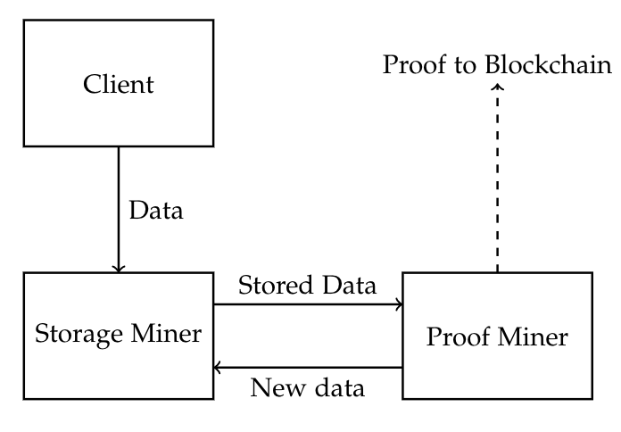
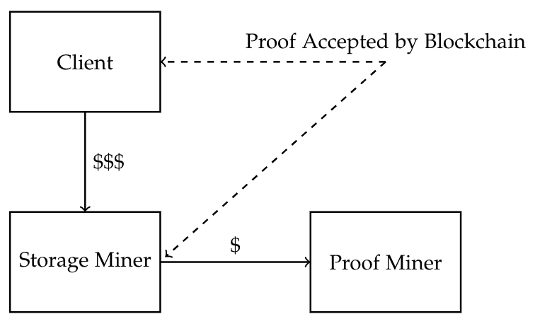

# Shilling

A decentralised file storage system for computationally limited devices. This was in part made for Harvard's CS244 in Spring 2018, taught by [Professor Kung](https://en.wikipedia.org/wiki/H._T._Kung). 

## Usage

First, start up Truffle Ganache, and run
```
python3 setup_environment.py
```
Our scheme is currently designed to be tested with .txt files. All of the file names should have be of the form ```xyz.txt```, where ```xyz``` is a number. Files should be placed in the files/ directory.

In order to start a client node that wishes to store file ```xyz.txt``` 
```
python3 client.py xyz
```
To start up a storer node that accepts client requests to store files, run
```
python3 storer.py
```
Finally, to start up a prover node that accepts storer requests for proofs and generates proof chains, run
```
python3 prover.py
```

## Installation
We rely on a submodule for the implementation of 
[Proofs of Sequential Work](https://github.com/wfus/proof-of-sequential-work), 
which implements the 2018 EUROCRYPT paper 
["Simple Proofs of Sequential Work" by Cohen and Pietrzak](https://eprint.iacr.org/2018/183.pdf). 
We use this as part of the Proof of Spacetime scheme in our project. Check out the Proof of Sequential 
Work repository available at [https://github.com/wfus/proof-of-sequential-work](https://github.com/wfus/proof-of-sequential-work) 
to see system requirements and other information on how to run the package. The Proof of Sequential 
Work is necessary in order to run Shilling, so make sure to install all 
prerequisites for that first. 
```
git clone https://www.github.com/daninge98/shilling
git submodule update --init --recursive
git submodule foreach git pull origin master
```
 
Packages require Python 3 in order to be run. 

To install the dependencies, run
```
brew tap ethereum/ethereum
brew install solidity
pip3 install -r requirements.txt
```

If using a Mac, you can use our ```install.sh``` script to install the dependencies.
```
chmod +x install.sh
./install.sh
```

Other than Python libraries, we also require Truffle Ganache, which can be downloaded [here](http://truffleframework.com/ganache/).

## Overview

Our system will consider the following four adversarial nodes:

* __Client Nodes:__ These nodes have files that they wish to store. They will offer a reward for storing a file for a given time period. These nodes are not restricted by computational power.
* __Storage Miners:__ These nodes have limited computational power. These nodes are purely responsible for storing data, and only require the computational ability to store the data and transfer it into and out of storage.
* __Proof Miners:__ These nodes will perform proof-of-works for more computationally limited devices for a fee.

 


## Acknowledgements
We would like to thank all of the feedback we recieved from CS244, especially from [Professor Kung](https://en.wikipedia.org/wiki/H._T._Kung) and the TFs! Also, shoutout to [Professor Barak](http://www.boazbarak.org/) for all of the crypto help. 
