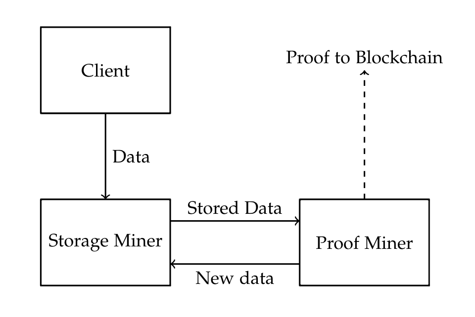

# Shilling

A decentralised file storage system for computationally limited devices. This was in part made for Harvard's CS244 in Spring 2018, taught by [Professor Kung](https://en.wikipedia.org/wiki/H._T._Kung). 

## Usage

## Overview

## External Dependencies

## Acknowledgements
We would like to thank all of the feedback we recieved from CS244, especially from [Professor Kung](https://en.wikipedia.org/wiki/H._T._Kung) and the TFs! Also, shoutout to [Professor Barak](http://www.boazbarak.org/) for all of the crypto help. 
